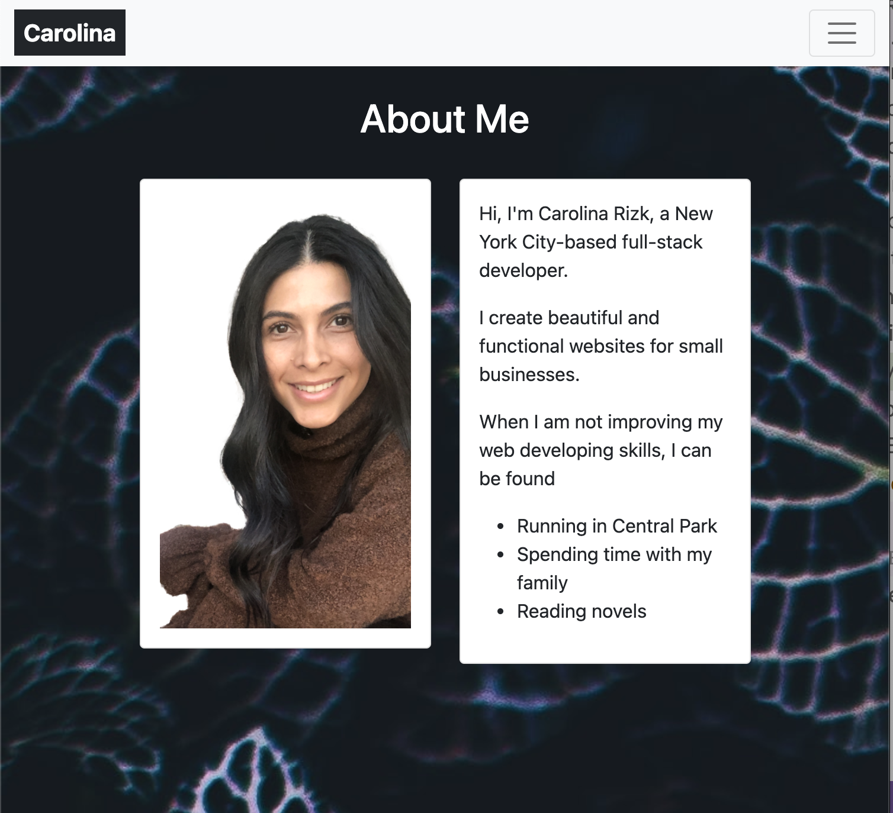
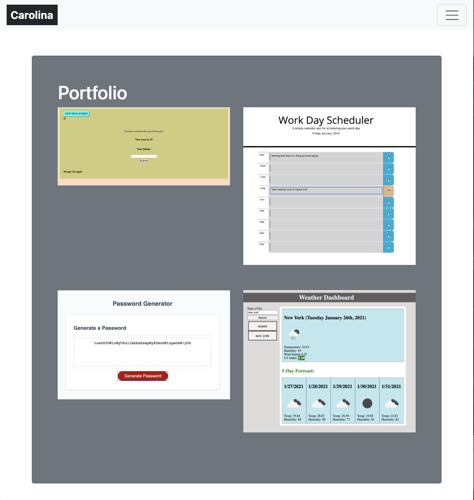

# Responsive Portfolio - Bootstrap

## Description

This is my responsive portofolio created using Bootstrap. It has three pages; a home, a contact, and a portfolio page. 
The homepage contains two cards. In one card, my headshot and a brief description about me in the other card. 
The contact page contains my home address, email address link, and a contact form. 
The portfolio page contains 6 images. These images are just placeholders for now and not my own photographs.

## Links
### GitHub Repo
https://github.com/crizk-crizk/MyPortfolio
### Live Link
https://crizk-crizk.github.io/MyPortfolio/
## Screenshots 

